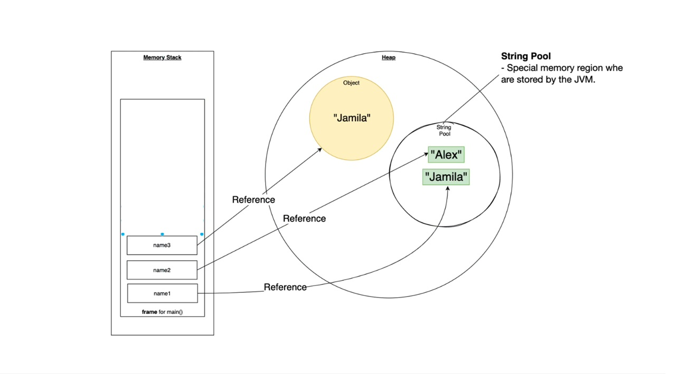

---

## 1️⃣ Memory Areas



### 🔹 Stack (left side)

* Stores **local variables** (`name1`, `name2`, `name3`)
* These variables don’t store the actual string
* They store **references (addresses)** to objects in Heap / String Pool

### 🔹 Heap (right side)

* Stores **objects created using `new` keyword**
* Example: `new String("Jamila")`

### 🔹 String Pool (inside Heap)

* A **special memory area** inside Heap
* Stores **unique string literals**
* JVM reuses existing strings to save memory

---

## 2️⃣ String Literal (String Pool behavior)

### Example:

```java
String name1 = "Jamila";
String name2 = "Alex";
```

### What happens :

* `"Jamila"` is created **once** in the **String Pool**
* `"Alex"` is created **once** in the **String Pool**
* `name1` points to `"Jamila"`
* `name2` points to `"Alex"`

📌 **Important**

* No duplicate strings are created
* JVM checks the String Pool first
* If string exists → reuse it

✔️ **Memory efficient**
✔️ **Fast comparison using `==`**

```java
name1 == name2   // false (different objects)
```

---

## 3️⃣ String Object (Heap behavior)

### Example:

```java
String name3 = new String("Jamila");
```

### What happens (shown as yellow object in diagram):

1. JVM checks String Pool

   * `"Jamila"` already exists → reused in pool
2. A **new String object** is created in the **Heap**
3. `name3` points to this **new Heap object**
4. Heap object internally refers to `"Jamila"` from pool

📌 **Key point**

* Even though text is same, **object is different**

```java
name1 == name3   // false (different memory locations)
name1.equals(name3) // true (same content)
```

---

## 4️⃣ Diagram-based summary

| Variable | Points to                 |
| -------- | ------------------------- |
| `name1`  | `"Jamila"` in String Pool |
| `name2`  | `"Alex"` in String Pool |
| `name3`  | `"Jamila"` object in Heap |

---

## 5️⃣ When to use what?

### ✅ Prefer String Literals

* When strings are constant
* Better memory usage
* Faster performance

### ⚠️ Use `new String()` only when

* You **explicitly need a new object**
* Rare use cases (security, legacy APIs)

---

## 6️⃣ One-line difference (Interview gold ✨)

> **String literal** uses String Pool and avoids duplicate objects,
> **String object (`new`)** always creates a new object in Heap.

---